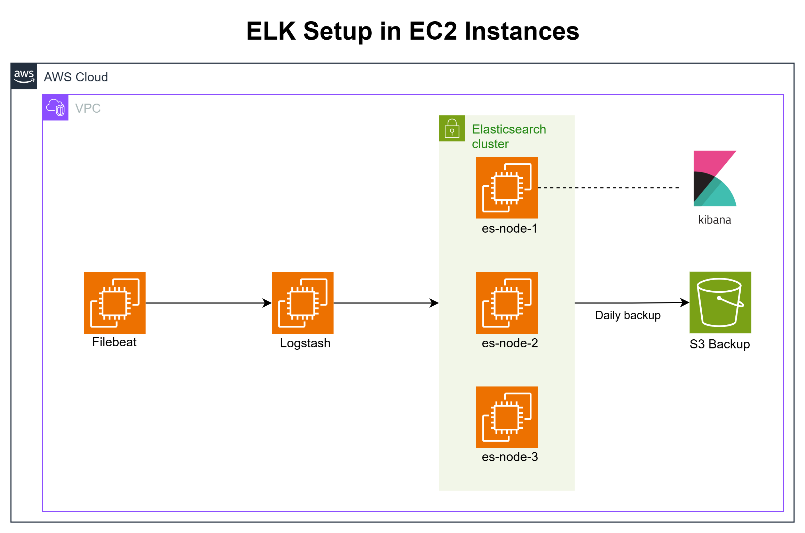

# Terraform Configuration for ELK Stack

This directory contains the Terraform configurations for deploying ELK Stack infrastructure in AWS. These configurations focus on creating the necessary cloud infrastructure components, which are then configured by Ansible playbooks in a separate step.

## Architecture Diagram



The diagram illustrates the AWS infrastructure that Terraform provisions:

- EC2 instances for Elasticsearch (master and data nodes), Kibana, Logstash, and Filebeat
- VPC with public and private subnets
- Security groups for controlling network access
- IAM roles and policies for S3 backup access
- S3 bucket for Elasticsearch snapshots

## Terraform Files Overview

```
terraform/
├── main.tf                 # Main configuration and resource dependencies
├── variables.tf            # Input variable declarations
├── outputs.tf              # Output value declarations
├── providers.tf            # Provider configuration
├── vpc.tf                  # VPC networking configuration 
├── elasticsearch.tf        # Elasticsearch instance configuration
├── logstash.tf             # Logstash instance configuration
├── filebeat.tf             # Filebeat instance configuration
├── s3_backup.tf            # S3 backup configuration
├── backup_variables.tf     # Backup-specific variables
├── data.tf                 # Data sources
├── terraform.tfvars        # Variable values (create from example file)
└── modules/                # Reusable modules
    ├── vpc/                # VPC module
    ├── ec2/                # EC2 instance module
    └── s3/                 # S3 module
```

## Manual Terraform Deployment

For DevOps engineers who want to directly control the Terraform deployment without using the deploy script, follow these steps:

### 1. Configure Variables

Create your `terraform.tfvars` file from the example:

```bash
cd /d/repos/nova-iris/elk-stack-setup/terraform
cp terraform.tfvars.example terraform.tfvars
```

Edit `terraform.tfvars` with your configuration:

```bash
nano terraform.tfvars
```

Key variables to configure:

```hcl
# AWS Region
region = "us-west-2"

# Environment name (used for resource naming)
environment = "production"

# VPC Configuration
create_new_vpc = true
vpc_cidr = "10.0.0.0/16"

# Instance Configuration
elasticsearch_instance_type = "t3.medium"
logstash_instance_type = "t3.medium"
filebeat_instance_type = "t3.small"

# Cluster Configuration
elasticsearch_master_count = 1
elasticsearch_data_count = 2

# SSH Key
ssh_key_name = "elk-stack-key"
```

### 2. Initialize and Apply

Initialize Terraform (only needed once or after module changes):

```bash
terraform init
```

Apply the configuration:

```bash
terraform plan -out=tfplan
terraform apply -auto-approve
```

### 3. Generate Ansible Inventory

After successful deployment, generate the Ansible inventory file:

```bash
cd /d/repos/nova-iris/elk-stack-setup/terraform/scripts
./generate-ansible-inventory.sh
```

This will create an inventory file at `../ansible/inventory/elk.ini` for use with Ansible.

## Important Configuration Options

### VPC Options

- **Create New VPC**: Set `create_new_vpc = true` to create a new VPC
- **Use Existing VPC**: Set `create_new_vpc = false` and provide `vpc_id` and subnet IDs

### Elasticsearch Cluster Configuration

- `elasticsearch_master_count`: Number of dedicated master nodes
- `elasticsearch_data_count`: Number of data nodes
- `elasticsearch_instance_type`: Instance type for Elasticsearch nodes

### S3 Backup Configuration

- `es_use_s3_backups`: Enable/disable S3 backup infrastructure
- `s3_bucket_name`: Name for the S3 bucket (defaults to auto-generated name)
- `s3_backup_retention_days`: Number of days to retain backups

## Common Operations

### Apply Changes

To update the existing infrastructure:

```bash
cd /d/repos/nova-iris/elk-stack-setup/terraform
terraform plan -out=tfplan
terraform apply -auto-approve
```

### Refresh State

To sync Terraform state with actual AWS resources:

```bash
terraform refresh
```

### Examine State

```bash
# List all resources
terraform state list

# Show details of a specific resource
terraform state show aws_instance.elasticsearch_master[0]
```

### Target Specific Resources

Apply changes to specific resources:

```bash
terraform apply -target=module.vpc -auto-approve
```

### Destroy Infrastructure

To remove all infrastructure:

```bash
terraform destroy -auto-approve
```

To destroy specific components:

```bash
terraform destroy -target=aws_instance.logstash -auto-approve
```

## Remote State Management (Advanced)

To implement remote state storage in S3 with locking, add to `providers.tf`:

```hcl
terraform {
  backend "s3" {
    bucket         = "your-terraform-state-bucket"
    key            = "elk-stack/terraform.tfstate"
    region         = "us-west-2"
    dynamodb_table = "terraform-locks"
    encrypt        = true
  }
}
```

## Performance Tuning

For larger Elasticsearch clusters or production environments, consider:

1. Adjusting instance types in `terraform.tfvars`:
   ```hcl
   elasticsearch_instance_type = "r5.xlarge"
   ```

2. Enabling advanced monitoring:
   ```hcl
   enable_detailed_monitoring = true
   ```

3. Using dedicated EBS volumes for data:
   ```hcl
   elasticsearch_data_volume_size = 100
   elasticsearch_data_volume_type = "gp3"
   ```